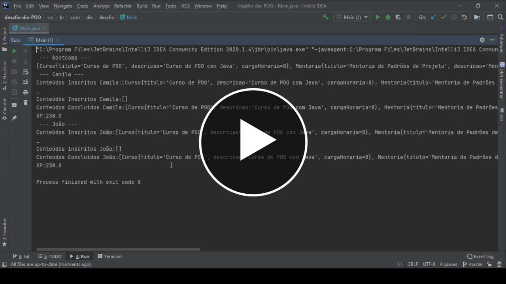
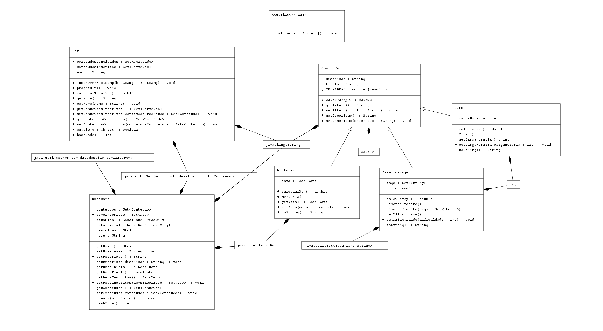

# Desafio-Java-Dio-SpringFrameworkExperience-Bootcamp
Desafio de Projeto de OO com Java no Bootcamp Spring Framework Experience na Dio. Nesse projeto foi feita uma abstração do conceito de um Bootcamp, e me diverti muito ao construí-lo do zero, junto a mentora [Camila](https://github.com/cami-la), que explica super bem o conteúdo.

## Veja um video do projeto em funcionamento

  

## Features
No domínio, foram implementadas as classes **Dev**, **Bootcamp**, **Conteudo**, **Mentoria** e **Curso**. Mas eu tive a ideia de adicionar a classe **DesafioProjeto** que é um tipo de conteúdo que faz parte da maioria, senão de todos os Bootcamps. Então um Bootcamp tem vários Devs inscritos, e tem um conjunto de Conteudos; estes Devs por sua vez estão inscritos nos Conteudos do Bootcamp e possuem o XP calculado de forma única para cada tipo de Conteudo (Mentoria, Curso ou DesafioProjeto). Cada um desses tipos de Conteudo tem uma forma própria de calcular seu XP equivalente, e isso só é possível graças ao polimorfismo em Java.

## Confira o Diagrama de Classes do Projeto

</img>

Sintam-se livres para dar feedback e/ou contribuir.
